* [做项目（多个C++、Java、Go、测开、前端项目）](https://www.programmercarl.com/other/kstar.html)
* [刷算法（两个月高强度学算法）](https://www.programmercarl.com/xunlian/xunlianying.html)
* [背八股（40天挑战高频面试题）](https://www.programmercarl.com/xunlian/bagu.html)

# 743.网络延迟时间 

https://leetcode.cn/problems/network-delay-time/description/ 


有 n 个网络节点，标记为 1 到 n。

给你一个列表 times，表示信号经过 有向 边的传递时间。 times[i] = (ui, vi, wi)，其中 ui 是源节点，vi 是目标节点， wi 是一个信号从源节点传递到目标节点的时间。

现在，从某个节点 K 发出一个信号。需要多久才能使所有节点都收到信号？如果不能使所有节点收到信号，返回 -1 。

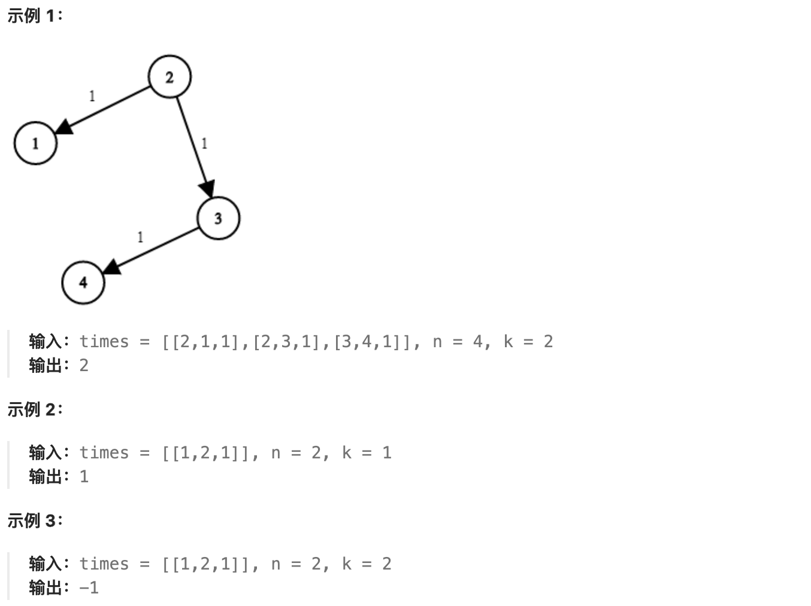

提示：

* 1 <= k <= n <= 100
* 1 <= times.length <= 6000
* times[i].length == 3
* 1 <= ui, vi <= n
* ui != vi
* 0 <= wi <= 100
* 所有 (ui, vi) 对都 互不相同（即，不含重复边）

# dijkstra 精讲

本题就是求最短路，最短路是图论中的经典问题即：给出一个有向图，一个起点，一个终点，问起点到终点的最短路径。 

接下来，我们来详细讲解最短路算法中的 dijkstra 算法。

dijkstra算法：在有权图（权值非负数）中求从起点到其他节点的最短路径算法。

需要注意两点： 

* dijkstra 算法可以同时求 起点到所有节点的最短路径
* 权值不能为负数 

（这两点后面我们会讲到）

如本题示例中的图：

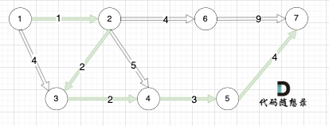

起点（节点1）到终点（节点7） 的最短路径是 图中 标记绿线的部分。

最短路径的权值为12。 

其实 dijkstra 算法  和 我们之前讲解的prim算法思路非常接近，如果大家认真学过[prim算法](https://mp.weixin.qq.com/s/yX936hHC6Z10K36Vm1Wl9w)，那么理解 Dijkstra 算法会相对容易很多。（这也是我要先讲prim再讲dijkstra的原因）

dijkstra 算法 同样是贪心的思路，不断寻找距离 源点最近的没有访问过的节点。 

这里我也给出 **dijkstra三部曲**：

1. 第一步，选源点到哪个节点近且该节点未被访问过
2. 第二步，该最近节点被标记访问过
3. 第三步，更新非访问节点到源点的距离（即更新minDist数组）

大家此时已经会发现，这和prim算法 怎么这么像呢。 

我在[prim算法](https://mp.weixin.qq.com/s/yX936hHC6Z10K36Vm1Wl9w)讲解中也给出了三部曲。 prim 和 dijkstra 确实很像，思路也是类似的，这一点我在后面还会详细来讲。

在dijkstra算法中，同样有一个数组很重要，起名为：minDist。 

**minDist数组 用来记录 每一个节点距离源点的最小距离**。 

理解这一点很重要，也是理解 dijkstra 算法的核心所在。 

大家现在看着可能有点懵，不知道什么意思。

没关系，先让大家有一个印象，对理解后面讲解有帮助。

我们先来画图看一下 dijkstra 的工作过程，以本题示例为例： （以下为朴素版dijkstra的思路） 

（**示例中节点编号是从1开始，所以为了让大家看的不晕，minDist数组下标我也从 1 开始计数，下标0 就不使用了，这样 下标和节点标号就可以对应上了，避免大家搞混**）

## 朴素版dijkstra 

### 模拟过程

----------- 

0、初始化

minDist数组数值初始化为int最大值。 

这里在强点一下 **minDist数组的含义：记录所有节点到源点的最短路径**，那么初始化的时候就应该初始为最大值，这样才能在后续出现最短路径的时候及时更新。 

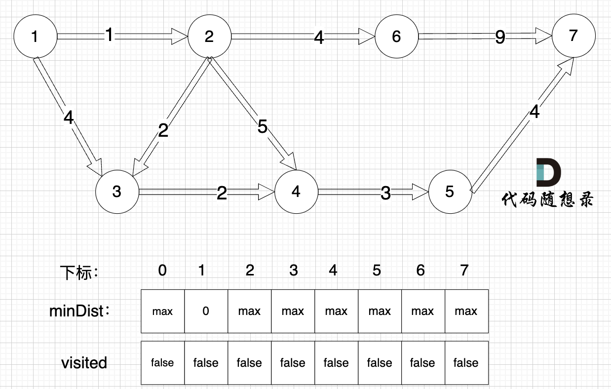

（图中，max 表示默认值，节点0 不做处理，统一从下标1 开始计算，这样下标和节点数值统一， 方便大家理解，避免搞混） 

源点（节点1） 到自己的距离为0，所以 minDist[1] = 0

此时所有节点都没有被访问过，所以 visited数组都为0

--------------- 

以下为dijkstra 三部曲

1、选源点到哪个节点近且该节点未被访问过

源点距离源点最近，距离为0，且未被访问。 

2、该最近节点被标记访问过 

标记源点访问过 

3、更新非访问节点到源点的距离（即更新minDist数组） ，如图： 

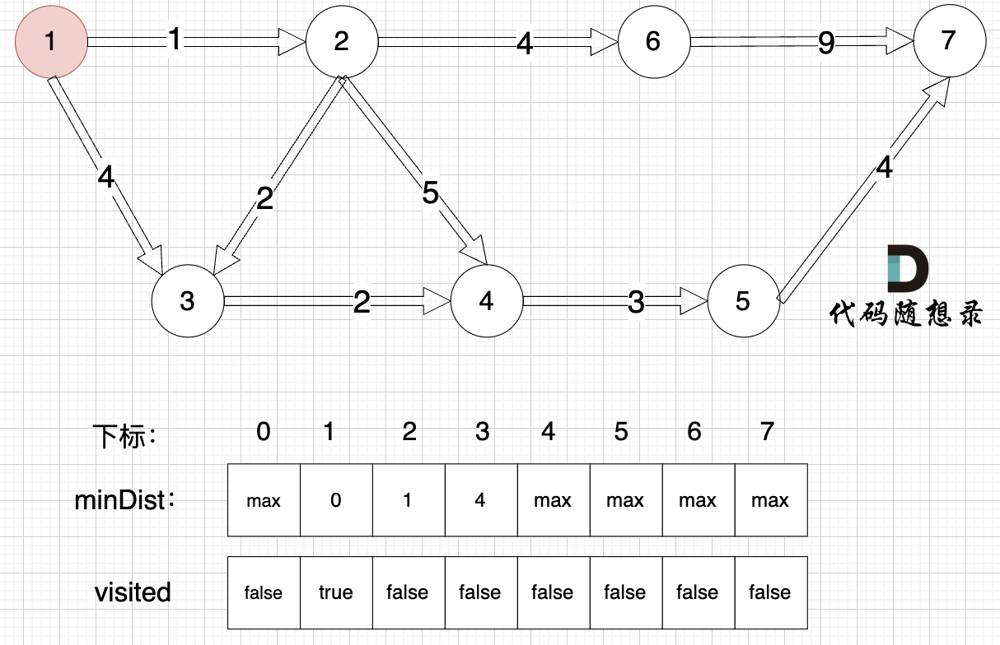


更新 minDist数组，即：源点（节点1） 到 节点2 和 节点3的距离。 

* 源点到节点2的最短距离为1，小于原minDist[2]的数值max，更新minDist[2] = 1 
* 源点到节点3的最短距离为4，小于原minDist[3]的数值max，更新minDist[4] = 4 

可能有录友问：为啥和 minDist[2] 比较？

再强调一下 minDist[2] 的含义，它表示源点到节点2的最短距离，那么目前我们得到了 源点到节点2的最短距离为1，小于默认值max，所以更新。 minDist[3]的更新同理


-------------

1、选源点到哪个节点近且该节点未被访问过

未访问过的节点中，源点到节点2距离最近，选节点2 

2、该最近节点被标记访问过 

节点2被标记访问过

3、更新非访问节点到源点的距离（即更新minDist数组） ，如图： 


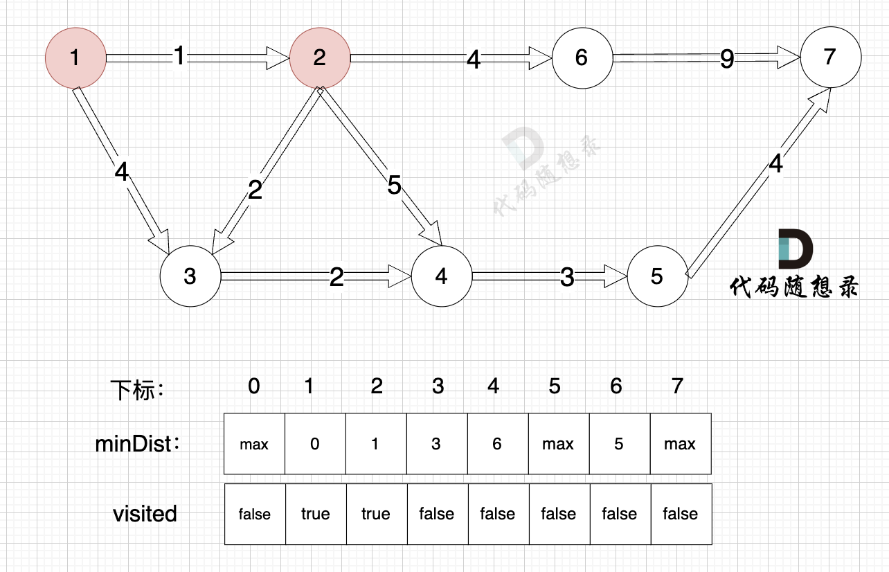

更新 minDist数组，即：源点（节点1） 到 节点6 、 节点3 和 节点4的距离。 

**为什么更新这些节点呢？ 怎么不更新其他节点呢**？

因为 源点（节点1）通过 已经计算过的节点（节点2） 可以链接到的节点 有 节点3，节点4和节点6. 


更新  minDist数组： 

* 源点到节点6的最短距离为5，小于原minDist[6]的数值max，更新minDist[6] = 5 
* 源点到节点3的最短距离为3，小于原minDist[3]的数值4，更新minDist[3] = 3 
* 源点到节点4的最短距离为6，小于原minDist[4]的数值max，更新minDist[4] = 6 


-------------------

1、选源点到哪个节点近且该节点未被访问过

未访问过的节点中，源点距离哪些节点最近，怎么算的？  

其实就是看 minDist数组里的数值，minDist 记录了 源点到所有节点的最近距离，结合visited数组筛选出未访问的节点就好。 

从 上面的图，或者 从minDist数组中，我们都能看出 未访问过的节点中，源点（节点1）到节点3距离最近。 


2、该最近节点被标记访问过 

节点3被标记访问过

3、更新非访问节点到源点的距离（即更新minDist数组） ，如图： 

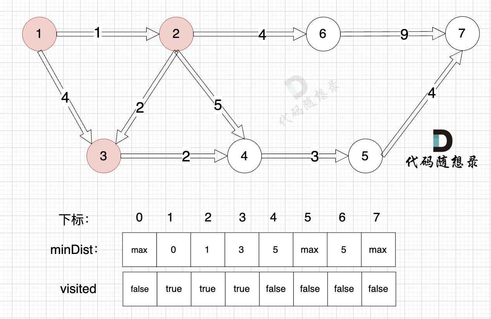

由于节点3的加入，那么源点可以有新的路径链接到节点4 所以更新minDist数组： 

更新  minDist数组： 

* 源点到节点4的最短距离为5，小于原minDist[4]的数值6，更新minDist[4] = 5 

------------------

1、选源点到哪个节点近且该节点未被访问过

距离源点最近且没有被访问过的节点，有节点4 和 节点6，距离源点距离都是 5 （minDist[4] = 5，minDist[6] = 5） ，选哪个节点都可以。 

2、该最近节点被标记访问过 

节点4被标记访问过

3、更新非访问节点到源点的距离（即更新minDist数组） ，如图： 

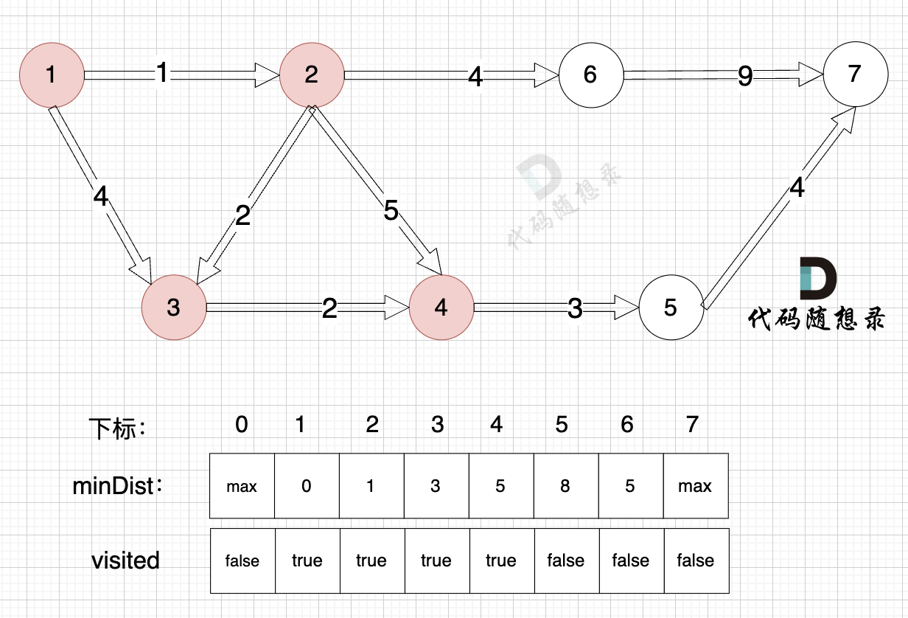 

由于节点4的加入，那么源点可以链接到节点5 所以更新minDist数组： 

* 源点到节点5的最短距离为8，小于原minDist[5]的数值max，更新minDist[5] = 8 

--------------

1、选源点到哪个节点近且该节点未被访问过

距离源点最近且没有被访问过的节点，是节点6，距离源点距离是 5 （minDist[6] = 5）  


2、该最近节点被标记访问过 

节点6 被标记访问过


3、更新非访问节点到源点的距离（即更新minDist数组） ，如图： 

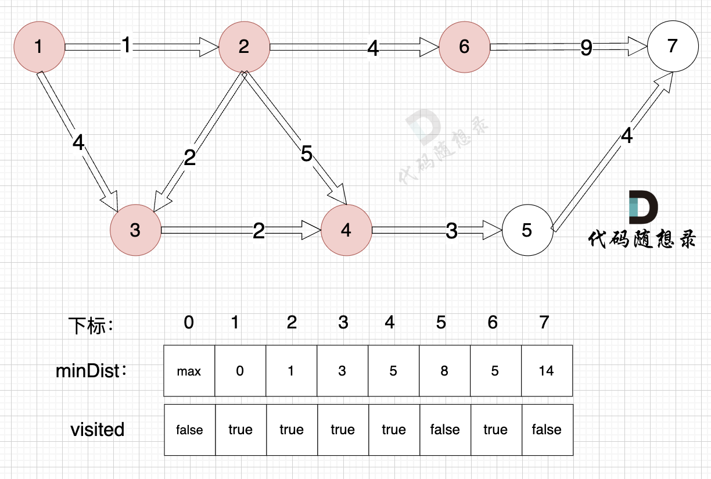

由于节点6的加入，那么源点可以链接到节点7 所以 更新minDist数组： 

* 源点到节点7的最短距离为14，小于原minDist[7]的数值max，更新minDist[7] = 14 


-------------------

1、选源点到哪个节点近且该节点未被访问过

距离源点最近且没有被访问过的节点，是节点5，距离源点距离是 8 （minDist[5] = 8）  

2、该最近节点被标记访问过 

节点5 被标记访问过

3、更新非访问节点到源点的距离（即更新minDist数组） ，如图： 

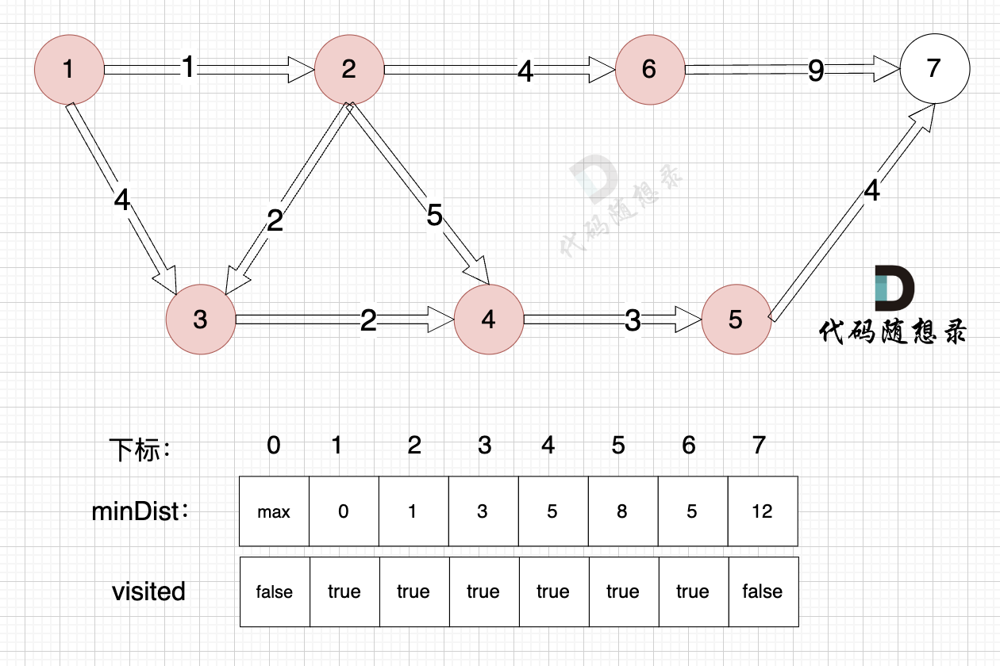 

由于节点5的加入，那么源点有新的路径可以链接到节点7 所以 更新minDist数组： 

* 源点到节点7的最短距离为12，小于原minDist[7]的数值14，更新minDist[7] = 12 

-----------------

1、选源点到哪个节点近且该节点未被访问过

距离源点最近且没有被访问过的节点，是节点7（终点），距离源点距离是 12 （minDist[7] = 12）  

2、该最近节点被标记访问过 

节点7 被标记访问过

3、更新非访问节点到源点的距离（即更新minDist数组） ，如图： 


节点7加入，但节点7到节点7的距离为0，所以 不用更新minDist数组 

--------------------

最后我们要求起点（节点1） 到终点 （节点7）的距离。 

再来回顾一下minDist数组的含义：记录 每一个节点距离源点的最小距离。  

那么起到（节点1）到终点（节点7）的最短距离就是 minDist[7] ，按上面举例讲解来说，minDist[7] = 12，节点1 到节点7的最短路径为 12。

路径如图： 

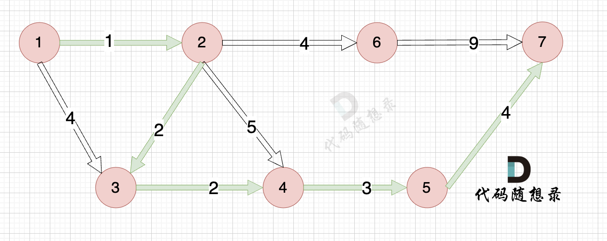 

在上面的讲解中，每一步 我都是按照 dijkstra 三部曲来讲解的，理解了这三部曲，代码也就好懂的。 

### 代码实现

本题代码如下，里面的 三部曲 我都做了注释，大家按照我上面的讲解 来看如下代码：

```CPP 
class Solution {
public:
    int networkDelayTime(vector<vector<int>>& times, int n, int k) {

        // 注意题目中给的二维数组并不是领接矩阵
        // 需要邻接矩阵来存图
        // 因为本题处理方式是节点标号从1开始，所以数组的大小都是 n+1
        vector<vector<int>> grid(n + 1, vector<int>(n + 1, INT_MAX));
        for(int i = 0; i < times.size(); i++){
            int p1 = times[i][0];
            int p2 = times[i][1];
            grid[p1][p2] = times[i][2];
        }

        // 存储从源点到每个节点的最短距离
        std::vector<int> minDist(n + 1, INT_MAX);  

        // 记录顶点是否被访问过
        std::vector<bool> visited(n + 1, false); 

        minDist[k] = 0;  // 起始点到自身的距离为0
        for (int i = 1; i <= n; i++) {

            int minVal = INT_MAX;
            int cur = 1;

            // 遍历每个节点，选择未被访问的节点集合中哪个节点到源点的距离最小
            for (int v = 1; v <= n; ++v) {
                if (!visited[v] && minDist[v] <= minVal) {
                    minVal = minDist[v];
                    cur = v;
                }
            }

            visited[cur] = true;  // 标记该顶点已被访问

            for (int v = 1; v <= n; v++) {
                if (!visited[v] && grid[cur][v] != INT_MAX && minDist[cur] + grid[cur][v] < minDist[v]) {
                    minDist[v] = minDist[cur] + grid[cur][v];
                }
            }


        }
        // 源点到最远的节点的时间，也就是寻找 源点到所有节点最短路径的最大值 
        int result = 0;
        for (int i = 1; i <= n; i++) {
            if (minDist[i] == INT_MAX) return -1;// 没有路径
            result = max(minDist[i], result);
        }
        return result;

    }
};
```

* 时间复杂度：O(n^2) 
* 空间复杂度：O(n^2)

### debug方法 

写这种题目难免会有各种各样的问题，我们如何发现自己的代码是否有问题呢？ 

最好的方式就是打日志，本题的话，就是将 minDist 数组打印出来，就可以很明显发现 哪里出问题了。 

每次选择节点后，minDist数组的变化是否符合预期 ，是否和我上面讲的逻辑是对应的。 

例如本题，如果想debug的话，打印日志可以这样写： 


```CPP 
class Solution {
public:
    int networkDelayTime(vector<vector<int>>& times, int n, int k) {

        // 注意题目中给的二维数组并不是领接矩阵
        // 需要邻接矩阵来存图
        // 因为本题处理方式是节点标号从1开始，所以数组的大小都是 n+1
        vector<vector<int>> grid(n + 1, vector<int>(n + 1, INT_MAX));
        for(int i = 0; i < times.size(); i++){
            int p1 = times[i][0];
            int p2 = times[i][1];
            grid[p1][p2] = times[i][2];
        }

        // 存储从源点到每个节点的最短距离
        std::vector<int> minDist(n + 1, INT_MAX);

        // 记录顶点是否被访问过
        std::vector<bool> visited(n + 1, false);

        minDist[k] = 0;  // 起始点到自身的距离为0
        for (int i = 1; i <= n; i++) {

            int minVal = INT_MAX;
            int cur = 1;

            // 遍历每个节点，选择未被访问的节点集合中哪个节点到源点的距离最小
            for (int v = 1; v <= n; ++v) {
                if (!visited[v] && minDist[v] <= minVal) {
                    minVal = minDist[v];
                    cur = v;
                }
            }

            visited[cur] = true;  // 标记该顶点已被访问

            for (int v = 1; v <= n; v++) {
                if (!visited[v] && grid[cur][v] != INT_MAX && minDist[cur] + grid[cur][v] < minDist[v]) {
                    minDist[v] = minDist[cur] + grid[cur][v];
                }
            }
            // 打印日志：
            cout << "select:" << cur << endl;
            for (int v = 1; v <= n; v++) cout <<  v << ":" << minDist[v] << " ";
            cout << endl << endl;;


        }
        // 源点到最远的节点的时间，也就是寻找 源点到所有节点最短路径的最大值
        int result = 0;
        for (int i = 1; i <= n; i++) {
            if (minDist[i] == INT_MAX) return -1;// 没有路径
            result = max(minDist[i], result);
        }
        return result;

    }
};


```

打印后的结果： 

```
select:2
1:1 2:0 3:1 4:2147483647

select:3
1:1 2:0 3:1 4:2

select:1
1:1 2:0 3:1 4:2

select:4
1:1 2:0 3:1 4:2
```

打印日志可以和上面我讲解的过程进行对比，每一步的结果是完全对应的。 

所以如果大家如果代码有问题，打日志来debug是最好的方法 

### 出现负数 

如果图中边的权值为负数，dijkstra 还合适吗？ 

看一下这个图： （有负权值）

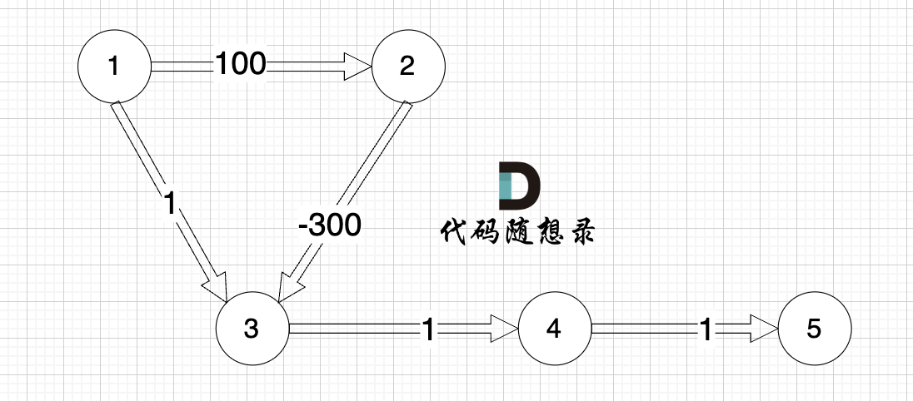 

节点1 到 节点5 的最短路径 应该是 节点1 -> 节点2 -> 节点3 -> 节点4 -> 节点5  

那我们来看dijkstra 求解的路径是什么样的，继续dijkstra 三部曲来模拟 ：（dijkstra模拟过程上面已经详细讲过，以下只模拟重要过程，例如如何初始化就省略讲解了） 

----------- 

初始化： 

 

--------------- 

1、选源点到哪个节点近且该节点未被访问过

源点距离源点最近，距离为0，且未被访问。 

2、该最近节点被标记访问过 

标记源点访问过 

3、更新非访问节点到源点的距离（即更新minDist数组） ，如图： 

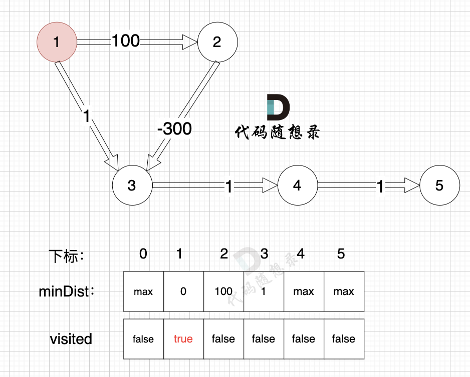

更新 minDist数组，即：源点（节点1） 到 节点2 和 节点3的距离。 

* 源点到节点2的最短距离为100，小于原minDist[2]的数值max，更新minDist[2] = 100 
* 源点到节点3的最短距离为1，小于原minDist[3]的数值max，更新minDist[4] = 1 

-------------------

1、选源点到哪个节点近且该节点未被访问过

源点距离节点3最近，距离为1，且未被访问。 

2、该最近节点被标记访问过 

标记节点3访问过 

3、更新非访问节点到源点的距离（即更新minDist数组） ，如图： 

 

由于节点3的加入，那么源点可以有新的路径链接到节点4 所以更新minDist数组： 

* 源点到节点4的最短距离为2，小于原minDist[4]的数值max，更新minDist[4] = 2 

--------------

1、选源点到哪个节点近且该节点未被访问过

源点距离节点4最近，距离为2，且未被访问。 

2、该最近节点被标记访问过 

标记节点4访问过 

3、更新非访问节点到源点的距离（即更新minDist数组） ，如图： 


由于节点4的加入，那么源点可以有新的路径链接到节点5 所以更新minDist数组： 

* 源点到节点5的最短距离为3，小于原minDist[5]的数值max，更新minDist[5] = 5 

------------

1、选源点到哪个节点近且该节点未被访问过

源点距离节点5最近，距离为3，且未被访问。 

2、该最近节点被标记访问过 

标记节点5访问过 

3、更新非访问节点到源点的距离（即更新minDist数组） ，如图： 

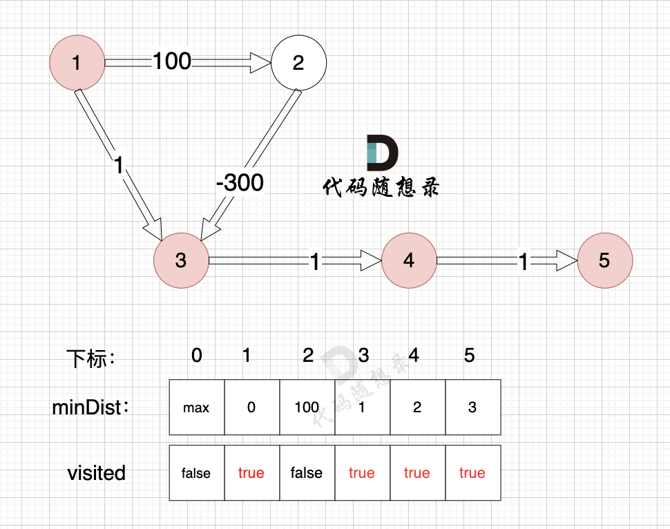 

节点5的加入，而节点5 没有链接其他节点， 所以不用更新minDist数组，仅标记节点5被访问过了 

------------ 

1、选源点到哪个节点近且该节点未被访问过

源点距离节点2最近，距离为100，且未被访问。 

2、该最近节点被标记访问过 

标记节点2访问过 

3、更新非访问节点到源点的距离（即更新minDist数组） ，如图： 

 

-------------- 

至此dijkstra的模拟过程就结束了，根据最后的minDist数组，我们求 节点1 到 节点5 的最短路径的权值总和为 3，路径： 节点1 -> 节点3 -> 节点4 -> 节点5

通过以上的过程模拟，我们可以发现 之所以 没有走有负权值的最短路径 是因为 在 访问 节点 2 的时候，节点 3 已经访问过了，就不会再更新了。 

那有录友可能会想： 我可以改代码逻辑啊，访问过的节点，也让它继续访问不就好了？ 

那么访问过的节点还能继续访问会不会有死循环的出现呢？控制逻辑不让其死循环？那特殊情况自己能都想清楚吗？（可以试试，实践出真知） 

对于负权值的出现，大家可以针对某一个场景 不断去修改 dijkstra 的代码，**但最终会发现只是 拆了东墙补西墙**，对dijkstra的补充逻辑只能满足某特定场景最短路求解。  

对于求解带有负权值的最短路问题，可以使用 Floyd 算法 ，我在后序会详细讲解。

## dijkstra与prim算法的区别 

> 这里再次提示，需要先看我的 [prim算法精讲](https://mp.weixin.qq.com/s/yX936hHC6Z10K36Vm1Wl9w) ，否则可能不知道我下面讲的是什么。

大家可以发现 dijkstra的代码看上去 怎么和 prim算法这么像呢。 

其实代码大体不差，唯一区别在 三部曲中的 第三步： 更新minDist数组 

因为**prim是求 非访问节点到最小生成树的最小距离，而 dijkstra是求 非访问节点到源点的最小距离**。

prim 更新 minDist数组的写法：  


```CPP 
for (int j = 1; j <= v; j++) {
    if (!isInTree[j] && grid[cur][j] < minDist[j]) {
        minDist[j] = grid[cur][j];
    }
}
```

因为 minDist表示 节点到最小生成树的最小距离，所以 新节点cur的加入，只需要 使用 grid[cur][j] ，grid[cur][j] 就表示 cur 加入生成树后，生成树到 节点j 的距离。 

dijkstra 更新 minDist数组的写法：

```CPP 
for (int v = 1; v <= n; v++) {
    if (!visited[v] && grid[cur][v] != INT_MAX && minDist[cur] + grid[cur][v] < minDist[v]) {
        minDist[v] = minDist[cur] + grid[cur][v];
    }
}
```

因为 minDist表示 节点到源点的最小距离，所以 新节点 cur 的加入，需要使用 源点到cur的距离 （minDist[cur]） + cur 到 节点 v 的距离 （grid[cur][v]），才是 源点到节点v的距离。 

此时大家可能不禁要想  prim算法 可以有负权值吗？ 

当然可以！ 

录友们可以自己思考思考一下，这是为什么？

这里我提示一下：prim算法只需要将节点以最小权值和链接在一起，不涉及到单一路径。 


## 总结 

本篇，我们深入讲解的dijkstra算法，详细模拟其工作的流程。 

这里我给出了 **dijkstra 三部曲 来 帮助大家理解 该算法**，不至于 每次写 dijkstra 都是黑盒操作，没有框架没有章法。 

在给出的代码中，我也按照三部曲的逻辑来给大家注释，只要理解这三部曲，即使 过段时间 对 dijkstra 算法有些遗忘，依然可以写出一个框架出来，然后再去调试细节。 

对于图论算法，一般代码都比较长，很难写出代码直接可以提交通过，都需要一个debug的过程，所以 **学习如何debug 非常重要**！ 

这也是我为什么 在本文中 单独用来讲解 debug方法。 

本题求的是最短路径和是多少，**同时我们也要掌握 如何把最短路径打印出来**。  

我还写了大篇幅来讲解 负权值的情况， 只有画图带大家一步一步去 看 出现负权值 dijkstra的求解过程，才能帮助大家理解，问题出在哪里。

如果我直接讲：是**因为访问过的节点 不能再访问，导致错过真正的最短路**，我相信大家都不知道我在说啥。 

最后我还讲解了 dijkstra 和 prim 算法的 相同 与 不同之处， 我在图论的讲解安排中 先讲 prim算法 再讲 dijkstra 是有目的的， **理解这两个算法的相同与不同之处 有助于大家学习的更深入**。 

而不是 学了 dijkstra 就只看 dijkstra， 算法之间 都是有联系的，多去思考 算法之间的相互联系，会帮助大家思考的更深入，掌握的更彻底。 

本篇写了这么长，我也只讲解了 朴素版dijkstra，**关于 堆优化dijkstra，我会在下一篇再来给大家详细讲解**。 


## 堆优化版本dijkstra

> 本篇我们来讲解 堆优化版dijkstra，看本篇之前，一定要先看 我讲解的 朴素版dijkstra，否则本篇会有部分内容看不懂。

在上一篇中，我们讲解了朴素版的dijkstra，该解法的时间复杂度为 O(n^2)，可以看出时间复杂度 只和 n （节点数量）有关系。

如果n很大的话，我们可以换一个角度来优先性能。

在 讲解 最小生成树的时候，我们 讲了两个算法，[prim算法](https://mp.weixin.qq.com/s/yX936hHC6Z10K36Vm1Wl9w)（从点的角度来求最小生成树）、[Kruskal算法](https://mp.weixin.qq.com/s/rUVaBjCES_4eSjngceT5bw)（从边的角度来求最小生成树）

这么在n 很大的时候，也有另一个思考维度，即：从边的数量出发。

当 n 很大，边 的数量 也很多的时候（稠密图），那么 上述解法没问题。 

但 n 很大，边 的数量 很小的时候（稀疏图），是不是可以换成从边的角度来求最短路呢？

毕竟边的数量少。 

有的录友可能会想，n （节点数量）很大，边不就多吗？ 怎么会边的数量少呢？ 

别忘了，谁也没有规定 节点之间一定要有边连接着，例如有一万个节点，只有一条边，这也是一张图。

了解背景之后，再来看 解法思路。 

### 图的存储

首先是 图的存储。 

关于图的存储 主流有两种方式： 邻接矩阵和邻接表 

#### 邻接矩阵 

邻接矩阵 使用 二维数组来表示图结构。 邻接矩阵是从节点的角度来表示图，有多少节点就申请多大的二维数组。

例如： grid[2][5] = 6，表示 节点 2 链接 节点5 为有向图，节点2 指向 节点5，边的权值为6 （套在题意里，可能是距离为6 或者 消耗为6 等等） 

如果想表示无向图，即：grid[2][5] = 6，grid[5][2] = 6，表示节点2 与 节点5 相互连通，权值为6。


如图： 

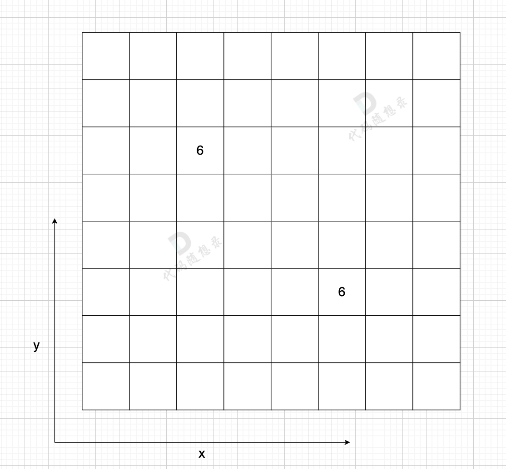 

在一个 n （节点数）为8 的图中，就需要申请 8 * 8 这么大的空间，有一条双向边，即：grid[2][5] = 6，grid[5][2] = 6

这种表达方式（邻接矩阵） 在 边少，节点多的情况下，会导致申请过大的二维数组，造成空间浪费。 

而且在寻找节点链接情况的时候，需要遍历整个矩阵，即 n * n 的时间复杂度，同样造成时间浪费。 

邻接矩阵的优点： 

* 表达方式简单，易于理解
* 检查任意两个顶点间是否存在边的操作非常快
* 适合稠密图，在边数接近顶点数平方的图中，邻接矩阵是一种空间效率较高的表示方法。 

缺点： 

* 遇到稀疏图，会导致申请过大的二维数组造成空间浪费 且遍历 边 的时候需要遍历整个n * n矩阵，造成时间浪费 

#### 邻接表

邻接表 使用 数组 + 链表的方式来表示。 邻接表是从边的数量来表示图，有多少边 才会申请对应大小的链表。 

邻接表的构造如图： 

 

这里表达的图是： 

* 节点1 指向 节点3 和 节点5 
* 节点2 指向 节点4、节点3、节点5 
* 节点3 指向 节点4，节点4指向节点1。 

有多少边 邻接表才会申请多少个对应的链表节点。 

从图中可以直观看出 使用 数组 + 链表 来表达 边的链接情况 。 

邻接表的优点： 

* 对于稀疏图的存储，只需要存储边，空间利用率高 
* 遍历节点链接情况相对容易

缺点： 

* 检查任意两个节点间是否存在边，效率相对低，需要 O(V)时间，V表示某节点链接其他节点的数量。
* 实现相对复杂，不易理解 

#### 本题图的存储

接下来我们继续按照稀疏图的角度来分析本题。 

在第一个版本的实现思路中，我们提到了三部曲：

1. 第一步，选源点到哪个节点近且该节点未被访问过
2. 第二步，该最近节点被标记访问过
3. 第三步，更新非访问节点到源点的距离（即更新minDist数组）

在第一个版本的代码中，这三部曲是套在一个 for 循环里，为什么？ 

因为我们是从节点的角度来解决问题。 

三部曲中第一步（选源点到哪个节点近且该节点未被访问过），这个操作本身需要for循环遍历 minDist 来寻找最近的节点。  

同时我们需要 遍历所有 未访问过的节点，所以 我们从 节点角度出发，代码会有两层for循环，代码是这样的： （注意代码中的注释，标记两层for循环的用处）

```CPP 

for (int i = 1; i <= n; i++) { // 遍历所有节点，第一层for循环 

    int minVal = INT_MAX;
    int cur = 1;

    // 1、选距离源点最近且未访问过的节点 ， 第二层for循环
    for (int v = 1; v <= n; ++v) {
        if (!visited[v] && minDist[v] < minVal) {
            minVal = minDist[v];
            cur = v;
        }
    }

    visited[cur] = true;  // 2、标记该节点已被访问

    // 3、第三步，更新非访问节点到源点的距离（即更新minDist数组）
    for (int v = 1; v <= n; v++) {
        if (!visited[v] && grid[cur][v] != INT_MAX && minDist[cur] + grid[cur][v] < minDist[v]) {
            minDist[v] = minDist[cur] + grid[cur][v];
        }
    }

}
```

那么当从 边 的角度出发， 在处理 三部曲里的第一步（选源点到哪个节点近且该节点未被访问过）的时候 ，我们可以不用去遍历所有节点了。

而且 直接把 边（带权值）加入到 小顶堆（利用堆来自动排序），那么每次我们从 堆顶里 取出 边 自然就是 距离源点最近的节点所在的边。 

这样我们就不需要两层for循环来寻找最近的节点了。 

了解了大体思路，我们再来看代码实现。 

首先是 如何使用 邻接表来表述图结构，这是摆在很多录友面前的第一个难题。 

邻接表用 数组+链表 来表示，代码如下：（C++中 vector 为数组，list 为链表， 定义了 n+1 这么大的数组空间） 

```CPP 
vector<list<int>> grid(n + 1);
```
 
不少录友，不知道 如何定义的数据结构，怎么表示邻接表的，我来给大家画一个图：

 

图中邻接表表示： 

* 节点1 指向 节点3 和 节点5 
* 节点2 指向 节点4、节点3、节点5 
* 节点3 指向 节点4 
* 节点4 指向 节点1 

大家发现图中的边没有权值，而本题中 我们的边是有权值的，权值怎么表示？在哪里表示？ 

所以 在`vector<list<int>> grid(n + 1);` 中 就不能使用int了，而是需要一个键值对 来存两个数字，一个数表示节点，一个数表示 指向该节点的这条边的权值。 

那么 代码可以改成这样： （pair 为键值对，可以存放两个int）

```CPP 
vector<list<pair<int,int>>> grid(n + 1);
```

举例来给大家展示 该代码表达的数据 如下：


* 节点1 指向 节点3 权值为 1  
* 节点1 指向 节点5 权值为 2 
* 节点2 指向 节点4 权值为 7 
* 节点2 指向 节点3 权值为 6
* 节点2 指向 节点5 权值为 3 
* 节点3 指向 节点4 权值为 3 
* 节点5 指向 节点1 权值为 10 

这样 我们就把图中权值表示出来了。

但是在代码中 使用 `pair<int, int>` 很容易让我们搞混了，第一个int 表示什么，第二个int表示什么，导致代码可读性很差，或者说别人看你的代码看不懂。 

那么 可以 定一个类 来取代 `pair<int, int>` 

类（或者说是结构体）定义如下： 

```CPP
struct Edge {
    int to;  // 邻接顶点
    int val; // 边的权重

    Edge(int t, int w): to(t), val(w) {}  // 构造函数
};
```

这个类里有两个成员变量，有对应的命名，这样不容易搞混 两个int的含义。 

所以 本题中邻接表的定义如下： 

```CPP 
struct Edge {
    int to;  // 链接的节点
    int val; // 边的权重

    Edge(int t, int w): to(t), val(w) {}  // 构造函数
};

vector<list<Edge>> grid(n + 1); // 邻接表

```

（我们在下面的讲解中会直接使用这个邻接表的代码表示方式）

### 堆优化细节

其实思路依然是 dijkstra 三部曲： 

1. 第一步，选源点到哪个节点近且该节点未被访问过
2. 第二步，该最近节点被标记访问过
3. 第三步，更新非访问节点到源点的距离（即更新minDist数组）

只不过之前是 通过遍历节点来遍历边，通过两层for循环来寻找距离源点最近节点。 这次我们直接遍历边，且通过堆来对边进行排序，达到直接选择距离源点最近节点。 

先来看一下针对这三部曲，如果用 堆来优化。 

那么三部曲中的第一步（选源点到哪个节点近且该节点未被访问过），我们如何选？ 

我们要选择距离源点近的节点（即：该边的权值最小），所以 我们需要一个 小顶堆 来帮我们对边的权值排序，每次从小顶堆堆顶 取边就是权值最小的边。

C++定义小顶堆，可以用优先级队列实现，代码如下：

```CPP 
// 小顶堆
class mycomparison {
public:
    bool operator()(const pair<int, int>& lhs, const pair<int, int>& rhs) {
        return lhs.second > rhs.second;
    }
};
// 优先队列中存放 pair<节点编号，源点到该节点的权值> 
priority_queue<pair<int, int>, vector<pair<int, int>>, mycomparison> pq;
```

（`pair<int, int>`中 第二个int 为什么要存 源点到该节点的权值，因为 这个小顶堆需要按照权值来排序）


有了小顶堆自动对边的权值排序，那我们只需要直接从 堆里取堆顶元素（小顶堆中，最小的权值在上面），就可以取到离源点最近的节点了 （未访问过的节点，不会加到堆里进行排序） 

所以三部曲中的第一步，我们不用 for循环去遍历，直接取堆顶元素： 

```CPP 
// pair<节点编号，源点到该节点的权值>
pair<int, int> cur = pq.top(); pq.pop();

```

第二步（该最近节点被标记访问过） 这个就是将 节点做访问标记，和 朴素dijkstra 一样 ，代码如下： 

```CPP 
// 2. 第二步，该最近节点被标记访问过
visited[cur.first] = true;

```

（`cur.first` 是指取 `pair<int, int>` 里的第一个int，即节点编号 ）

第三步（更新非访问节点到源点的距离），这里的思路 也是 和朴素dijkstra一样的。 

但很多录友对这里是最懵的，主要是因为两点： 

* 没有理解透彻 dijkstra 的思路 
* 没有理解 邻接表的表达方式 

我们来回顾一下 朴素dijkstra 在这一步的代码和思路（如果没看过我讲解的朴素版dijkstra，这里会看不懂） 

```CPP 

// 3、第三步，更新非访问节点到源点的距离（即更新minDist数组）
for (int v = 1; v <= n; v++) {
    if (!visited[v] && grid[cur][v] != INT_MAX && minDist[cur] + grid[cur][v] < minDist[v]) {
        minDist[v] = minDist[cur] + grid[cur][v];
    }
}
```

其中 for循环是用来做什么的？  是为了 找到 节点cur 链接指向了哪些节点，因为使用邻接矩阵的表达方式 所以把所有节点遍历一遍。 

而在邻接表中，我们可以以相对高效的方式知道一个节点链接指向哪些节点。 

再回顾一下邻接表的构造（数组 + 链表）： 

 

假如 加入的cur 是节点 2， 那么 grid[2] 表示的就是图中第二行链表。 （grid数组的构造我们在 上面 「图的存储」中讲过）

所以在邻接表中，我们要获取 节点cur 链接指向哪些节点，就是遍历 grid[cur节点编号] 这个链表。 

这个遍历方式，C++代码如下： 

```CPP 
for (Edge edge : grid[cur.first]) 
```

（如果不知道 Edge 是什么，看上面「图的存储」中邻接表的讲解）

`cur.first` 就是cur节点编号， 参考上面pair的定义： pair<节点编号，源点到该节点的权值>  

接下来就是更新 非访问节点到源点的距离，代码实现和 朴素dijkstra 是一样的，代码如下： 

```CPP 
// 3. 第三步，更新非访问节点到源点的距离（即更新minDist数组）
for (Edge edge : grid[cur.first]) { // 遍历 cur指向的节点，cur指向的节点为 edge
    // cur指向的节点edge.to，这条边的权值为 edge.val
    if (!visited[edge.to] && minDist[cur.first] + edge.val < minDist[edge.to]) { // 更新minDist
        minDist[edge.to] = minDist[cur.first] + edge.val;
        pq.push(pair<int, int>(edge.to, minDist[edge.to]));
    }
}
```

但为什么思路一样，有的录友能写出朴素dijkstra，但堆优化这里的逻辑就是写不出来呢？ 

**主要就是因为对邻接表的表达方式不熟悉**！ 

以上代码中，cur 链接指向的节点编号 为 edge.to， 这条边的权值为 edge.val ，如果对这里模糊的就再回顾一下 Edge的定义：

```CPP 
struct Edge {
    int to;  // 邻接顶点
    int val; // 边的权重

    Edge(int t, int w): to(t), val(w) {}  // 构造函数
};
```

确定该节点没有被访问过，`!visited[edge.to]` ， 目前 源点到cur.first的最短距离（minDist） +  cur.first 到 edge.to 的距离 （edge.val） 是否 小于 minDist已经记录的 源点到  edge.to 的距离 （minDist[edge.to]） 

如果是的话，就开始更新操作。 

即： 

```CPP 
if (!visited[edge.to] && minDist[cur.first] + edge.val < minDist[edge.to]) { // 更新minDist
    minDist[edge.to] = minDist[cur.first] + edge.val;
    pq.push(pair<int, int>(edge.to, minDist[edge.to])); // 由于cur节点的加入，而新链接的边，加入到优先级队里中
}

```

同时，由于cur节点的加入，源点又有可以新链接到的边，将这些边加入到优先级队里中。 


以上代码思路 和 朴素版dijkstra 是一样一样的，主要区别是两点： 

* 邻接表的表示方式不同 
* 使用优先级队列（小顶堆）来对新链接的边排序

### 代码实现 

堆优化dijkstra完整代码如下： 

```CPP
class Solution {
public:
    // 小顶堆
    class mycomparison {
    public:
        bool operator()(const pair<int, int>& lhs, const pair<int, int>& rhs) {
            return lhs.second > rhs.second;
        }
    };
    // 定义一个结构体来表示带权重的边
    struct Edge {
        int to;  // 邻接顶点
        int val; // 边的权重

        Edge(int t, int w): to(t), val(w) {}  // 构造函数
    };
    int networkDelayTime(vector<vector<int>>& times, int n, int k) {


        std::vector<std::list<Edge>> grid(n + 1);
        for(int i = 0; i < times.size(); i++){
            int p1 = times[i][0];
            int p2 = times[i][1];
            // p1 指向 p2，权值为 times[i][2]
            grid[p1].push_back(Edge(p2, times[i][2]));
        }

        // 存储从源点到每个节点的最短距离
        std::vector<int> minDist(n + 1, INT_MAX);

        // 记录顶点是否被访问过
        std::vector<bool> visited(n + 1, false);

        // 优先队列中存放 pair<节点，源点到该节点的距离>
        priority_queue<pair<int, int>, vector<pair<int, int>>, mycomparison> pq;

        pq.push(pair<int, int>(k, 0));
        minDist[k] = 0; // 这个不要忘了

        while (!pq.empty()) {
            // <节点， 源点到该节点的距离>
            // 1. 第一步，选源点到哪个节点近且该节点未被访问过 （通过优先级队列来实现）
            pair<int, int> cur = pq.top(); pq.pop();

            if (visited[cur.first]) continue;

            // 2. 第二步，该最近节点被标记访问过
            visited[cur.first] = true;


            // 3. 第三步，更新非访问节点到源点的距离（即更新minDist数组）
            for (Edge edge : grid[cur.first]) { // 遍历 cur指向的节点，cur指向的节点为 edge
                // cur指向的节点edge.to，这条边的权值为 edge.val
                if (!visited[edge.to] && minDist[cur.first] + edge.val < minDist[edge.to]) { // 更新minDist
                    minDist[edge.to] = minDist[cur.first] + edge.val;
                    pq.push(pair<int, int>(edge.to, minDist[edge.to]));
                }
            }

        }

        // 源点到最远的节点的时间，也就是寻找 源点到所有节点最短路径的最大值
        int result = 0;
        for (int i = 1; i <= n; i++) {
            if (minDist[i] == INT_MAX) return -1;// 没有路径
            result = max(minDist[i], result);
        }
        return result;

    }
};

```

* 时间复杂度：O(ElogE)  E 为边的数量 
* 空间复杂度：O(N + E)  N 为节点的数量

堆优化的时间复杂度 只和边的数量有关 和节点数无关，在 优先级队列中 放的也是边。 

以上代码中，`while (!pq.empty())` 里套了 `for (Edge edge : grid[cur.first])`  

`for` 里 遍历的是 当前节点 cur 所连接边。

那 当前节点cur 所连接的边 也是不固定的， 这就让大家分不清，这时间复杂度究竟是多少？  

其实 `for (Edge edge : grid[cur.first])`  里最终的数据走向 是 给队列里添加边。 

那么跳出局部代码，整个队列 一定是 所有边添加了一次，同时也弹出了一次。 

所以边添加一次时间复杂度是 O(E)， `while (!pq.empty())` 里每次都要弹出一个边来进行操作，在优先级队列（小顶堆）中 弹出一个元素的时间复杂度是 O(logE) ，这是堆排序的时间复杂度。 

（当然小顶堆里 是 添加元素的时候 排序，还是 取数元素的时候排序，这个无所谓，时间复杂度都是O(E)，总是是一定要排序的，而小顶堆里也不会滞留元素，有多少元素添加 一定就有多少元素弹出）

所以 该算法整体时间复杂度为 O（ElogE)   

网上的不少分析 会把 n （节点的数量）算进来，这个分析是有问题的，举一个极端例子，在n 为 10000，且是有一条边的 图里，以上代码，大家感觉执行了多少次？ 

`while (!pq.empty())` 中的 pq 存的是边，其实只执行了一次。

所以该算法时间复杂度 和 节点没有关系。 

至于空间复杂度，邻接表是 数组 + 链表  数组的空间 是 N ，有E条边 就申请对应多少个链表节点，所以是 复杂度是 N + E

## 拓展 

当然也有录友可能想 堆优化dijkstra 中 我为什么一定要用邻接表呢，我就用邻接矩阵 行不行 ？

也行的。 

但 正是因为稀疏图，所以我们使用堆优化的思路， 如果我们还用 邻接矩阵 去表达这个图的话，就是 一个高效的算法 使用了低效的数据结构，那么 整体算法效率 依然是低的。

如果还不清楚为什么要使用 邻接表，可以再看看上面 我在 「图的存储」标题下的讲解。 

这里我也给出 邻接矩阵版本的堆优化dijkstra代码： 

```CPP
class Solution {
public:
    // 小顶堆（按照<k ,v>中的v 来从小到大排序）
    class mycomparison {
    public:
        bool operator()(const pair<int, int>& lhs, const pair<int, int>& rhs) {
            return lhs.second > rhs.second;
        }
    };
    int networkDelayTime(vector<vector<int>>& times, int n, int k) {

        // 注意题目中给的二维数组并不是邻接矩阵
        // 需要邻接矩阵来存图
        // 因为本题处理方式是节点标号从1开始，所以数组的大小都是 n+1
        vector<vector<int>> grid(n + 1, vector<int>(n + 1, INT_MAX));
        for(int i = 0; i < times.size(); i++){
            int p1 = times[i][0];
            int p2 = times[i][1];
            grid[p1][p2] = times[i][2];
        }

        // 存储从源点到每个节点的最短距离
        std::vector<int> minDist(n + 1, INT_MAX);

        // 记录顶点是否被访问过
        std::vector<bool> visited(n + 1, false);

        // 优先队列中存放 [节点，源点到该节点的距离]
        priority_queue<pair<int, int>, vector<pair<int, int>>, mycomparison> pq;

        pq.push(pair<int, int>(k, 0));
        minDist[k] = 0; // 这个不要忘了

        while (!pq.empty()) {
            // <节点， 源点到该节点的距离>
            // 1、选距离源点最近且未访问过的节点
            pair<int, int> cur = pq.top(); pq.pop();

            if (visited[cur.first]) continue;

            // 2、标记该节点已被访问
            visited[cur.first] = true;

            // 3、第三步，更新非访问节点到源点的距离（即更新minDist数组）
            // 遍历 cur 可以链接的节点，更新 minDist[j] 
            for (int j = 1; j <= n; j++) {
                if (!visited[j] && grid[cur.first][j] != INT_MAX && (minDist[cur.first] + grid[cur.first][j] < minDist[j])) {
                    minDist[j] = minDist[cur.first] + grid[cur.first][j];
                    pq.push(pair<int, int>(j, minDist[j]));
                }
            }
        }

        // 源点到最远的节点的时间，也就是寻找 源点到所有节点最短路径的最大值
        int result = 0;
        for (int i = 1; i <= n; i++) {
            if (minDist[i] == INT_MAX) return -1;// 没有路径
            result = max(minDist[i], result);
        }


        return result;

    }
};

```

* 时间复杂度：O(E * (N + logE))   E为边的数量，N为节点数量
* 空间复杂度：O(log(N^2))

`while (!pq.empty())` 时间复杂度为 E ，while 里面 每次取元素 时间复杂度 为 logE，和 一个for循环 时间复杂度 为 N 。

所以整体是 E * (N + logE) 


## 总结 

在学习一种优化思路的时候，首先就要知道为什么要优化，遇到了什么问题。 

正如我在开篇就给大家交代清楚 堆优化方式的背景。 

堆优化的整体思路和 朴素版是大体一样的，区别是 堆优化从边的角度触发，且利用堆来排序。 

很多录友别说写堆优化 就是看 堆优化的代码也看的很懵。 

主要是因为两点： 

* 不熟悉邻接表的表达方式 
* 对dijkstra的实现思路还是不熟 

这是我为什么 本篇花了大力气来讲解 图的存储，就是为了让大家彻底理解邻接表以及邻接表的代码写法。 

至于 dijkstra的实现思路 ，朴素版 和 堆优化版本 都是 按照 dijkstra 三部曲来的。 

理解了三部曲，dijkstra 的思路就是清晰的。 

针对邻接表版本代码 我做了详细的 时间复杂度分析，也让录友们清楚，相对于 朴素版，时间都优化到哪了。 

最后 我也给出了 邻接矩阵的版本代码，分析了这一版本的必要性以及时间复杂度。 

至此通过 两篇dijkstra的文章，终于把 dijkstra 讲完了，如果大家对我讲解里所涉及的内容都吃透的话，详细对 dijkstra 算法也就理解到位了。 

这里在给出本题的Bellman_ford解法，关于 Bellman_ford ，后面我会专门来讲解的，Bellman_ford 有其独特的应用场景

```CPP 
class Solution {
public:

    int networkDelayTime(vector<vector<int>>& times, int n, int k) {
        vector<int> minDist(n + 1 , INT_MAX/2);
        minDist[k] = 0;
        //vector<int> minDist_copy(n); // 用来记录每一次遍历的结果
        for (int i = 1; i <= n + 1; i++) {
            //minDist_copy = minDist; // 获取上一次计算的结果
            for (auto &f : times) {
                int from = f[0];
                int to = f[1];
                int price = f[2];
                if (minDist[to] > minDist[from] + price) minDist[to] = minDist[from] + price;
            }

        }
        int result = 0;
        for (int i = 1;i <= n; i++) {
            if (minDist[i] == INT_MAX/2) return -1;// 没有路径
            result = max(minDist[i], result);
        }
        return result;

    }
};
```

